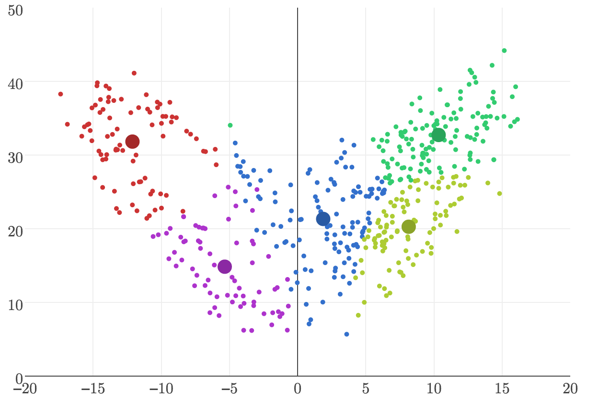

# kmpp

> The k-means algorithm with k-means++ initialization

## Introduction

This module implements k-means clustering with k-means++ initialization.

**Why another k-means moduel?**

To be honest, I found the API for most k-means modules a bit difficult to work with, and the modules that had a nice API didn't always work the best. So I took the best module I could find and tried to improve it. By the time I was done, I had a module I was happy with but which I felt had diverged too far to issue a reasonable pull request. So here we are. 🚀

## Example

[Click here for a live demo](http://rickyreusser.com/kmpp/) of three-dimensional k-means clustering on the Lorenz Attractor.

<a href="http://rickyreusser.com/kmpp/"></a>

To cluster points, just pass an array of arrays containing coordinates to `kmpp`. The output contains a list of centroids, a count of the number of points in each centroid, and a list of assignments of the original input to each centroid.

```javascript
var kmpp = require('<this module, from github>');

kmpp([
  [x1, y1, ...],
  [x2, y2, ...],
  [x3, y3, ...],
  ...
], {
  {k: 4}
});

// => 
// { centroids: [[xm1, ym1, ...], [xm2, ym2, ...], [xm3, ym3, ...]],
//   counts: [ 7, 6, 7 ],
//   assignments: [ 2, 2, 2, 2, 2, 2, 2, 0, 0, 0, 0, 0, 0, 0, 1, 1, 1, 1, 1, 1 ]
// }
```

## API

#### `require('kmpp'

## Credits

* [cmtt](https://github.com/cmtt) implemented the original version, of which
  this module is simply a major refactoring and extension.
* [Jared Harkins](https://github.com/hDeraj) improved the performance by
  reducing the amount of function calls, reverting to Manhattan distance
  for measurements and improved the random initialization by choosing from
  points

## Further reading

* [Wikipedia: k-means clustering](https://en.wikipedia.org/wiki/K-means_clustering)
* [Wikipedia: Determining the number of clusters in a data set](https://en.wikipedia.org/wiki/Determining_the_number_of_clusters_in_a_data_set)
* [k-means++: The advantages of careful seeding, Arthur Vassilvitskii](http://ilpubs.stanford.edu:8090/778/1/2006-13.pdf)
* [k-means++: The advantages of careful seeding, Presentation by Arthur Vassilvitskii (Presentation)](http://theory.stanford.edu/~sergei/slides/BATS-Means.pdf)

## License

&copy; 2016 Ricky Reusser. MIT License.
&copy; [cmtt](https://github.com/cmtt). MIT License.

[npm-image]: https://badge.fury.io/js/kmpp.svg
[npm-url]: https://npmjs.org/package/kmpp
[travis-image]: https://travis-ci.org/rreusser/kmpp.svg?branch=master
[travis-url]: https://travis-ci.org//kmpp
[daviddm-image]: https://david-dm.org/rreusser/kmpp.svg?theme=shields.io
[daviddm-url]: https://david-dm.org//kmpp
